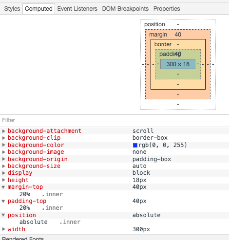

关于 CSS 的 `margin` 和 `padding` 属性，有一个比较有意思的小知识，不详细看 `w3c` 的说明并不会发现。

<!-- more -->

### 🌰栗子

```html
<!DOCTYPE html>
<html>

    <head>
        <meta charset="UTF-8">
        <title></title>
        <style type="text/css">
            .outer {
                position: relative;
                width: 200px;
                height: 100px;
                background: pink;
            }
            
            .mid {
                width: 100px;
                height: 100px;
                background: yellow;
            }
            
            .inner {
                background: blue;
                padding-top: 20%;
                margin-top: 20%;
                position: absolute;
                width: 300px;
                height: auto;
            }
        </style>
    </head>

    <body>
        <div class="outer">
            <div class="mid">
                <div class="inner">
                    test
                </div>
            </div>
        </div>
    </body>

</html>
```



上面可以看到，`margin-top` 和 `padding-top` 都是 `40px`，这 `40px` 怎么来的呢？

w3c 的[官网](https://www.w3.org/TR/CSS21/box.html#margin-properties)上有详细的说明，具体有一个描述是这样的：

> The percentage is calculated with respect to the width of the generated box's containing block, even for 'padding-top' and 'padding-bottom'. If the containing block's width depends on this element, then the resulting layout is undefined in CSS 2.1.

意思是当 `margin` `padding` 被设置为`百分比` 的时候，这个数值的计算是基于他的`包含块（containing block）`的宽度来计算的。那什么是`包含快`呢？

### 包含快（containing block）

`包含块` ≠ `父元素` ，以上面的栗子来说明，`.inner` 的 `父元素` 是 `.mid` ，它的宽度是 `100px` ，如果 `包含块` 是 `父元素` 的话，计算结果应该是 `20px` ，所以 `包含块` ≠ `父元素` 。事实 `40px` 是基于 `.outer` 计算出来的， `200px * 20% = 40px` ，为什么呢？

因为，如果元素具有 `position：absolute` ，`包含块` 则是离最近的 `position` 为 `absolute`，`relative` 或者 `fixed`  的 `块级祖先元素`。