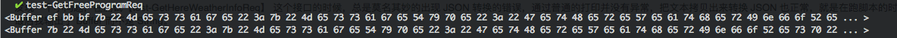
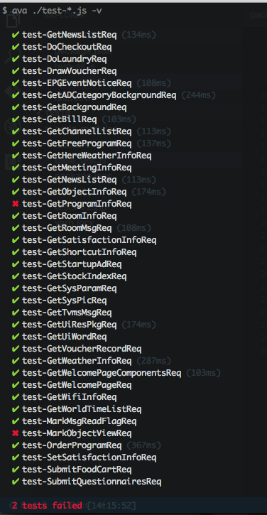

### 前因

在为团队写一个自动化脚本的时候，有一个测试硬是跑不过，错误总是提示 `JSON parsing: Unexpected Token error` 。一开始我以为是 JSON 文本的错，就 `console.log` 打印出来，然后 `copy` 到命令行执行，诡异的执行正确了。为了确认我重复了这个动作 N 遍，事实证明就是那么诡异。

<!-- more -->

### 后果

导致的后果就是，这个自动化测试脚本硬是跑不通过了，只好进入苦逼的 Debug 模式。

### 找原因

因为已经尝试过 `copy` 文本出来执行转换 `JSON` 是没问题的，所以至少 `JSON` 文本是正确的，那为什么跑脚本就一直是错误的呢？可以肯定的是，机器不会骗人（所以说自动化测试是多么的重要）。

然后抱着侥幸的心理，把文本 `trim` 了一下再 `JSON.parse` ，诡异的程序跑通了，我马上肯定（后面被自己打脸）是因为前后有空字符串导致的，还嘲讽了一下 `JavaScript` 怎么那么傻逼，这都不行，然后自己到命令行手动的加几个 `空格`  `回车` 什么的，结果 `JSON.parse` 通过了，好在只有自己知道 😂，要不然这脸丢大了。

既然可以确定 `trim` 之后程序就正常了，那肯定就是有空白字符的存在，但是可以明显看到，我 `console.log` 出来的字符串是没有空白的，不服气，我用程序对比了一下字符串，然而程序告诉我 `trim` 之后字符串的确发生了改变。这时我已经以为我疯了，然而再侥幸的，我把两次字符串转换成 `Buffer` 输出，这时候答案就出来了（又是一个巨大的坑）。

可以看到 `trim` 之前字符串前面多了三个字节 `ef` `bb` `bf` ，这个坑是跨平台编辑很容易遇上的一个问题，因为用 `unix` 系统久了，忘记了这个梗。

### UTF-8 With BOM

`BOM (Byte Order Mark)` , 微软在自己的UTF-8格式的文本文件之前加上了EF BB BF三个字节, windows上面的notepad等程序就是根据这三个字节来确定一个文本文件是ASCII的还是UTF-8的, 然而这个只是微软暗自作的标记, 其它平台上并没有对UTF-8文本文件做个这样的标记。

### 导致的原因

那为什么唯独这个接口会这样呢？提出问题之后一位同事查看了 Git History，发现这个 BOM 是在两年前某次更新不小心引入的，😂。

### 解决

如前面描述一样，把 `String` `trim` 一下就可以了，然后自动化测试脚本就正常了。

### 总结

所以我总是相信，机器不会骗人的，眼见并不一定为实，和人总是会犯错误的。

要保证自己在干的事情不是在制造 Bug，就需要一个验证自己在干的事情到底是不是产生了很多 Bug，这个验证的东西就叫做 `自动化回归测试` ，当你修改了程序不知道是否导致过往的程序的运行结果的时候，跑一遍就知道了。